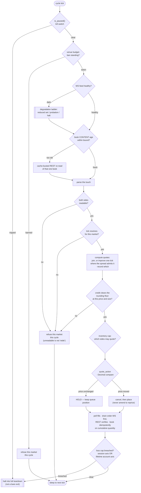
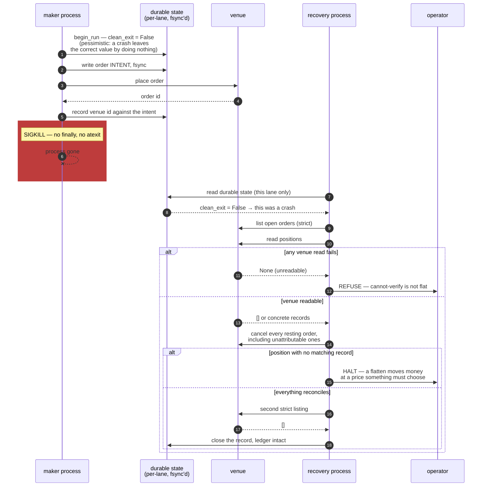

# Architecture

A technical map of the maker engines. For *why* each rail exists — the failure classes behind
them — see [`CASE_STUDY.md`](CASE_STUDY.md). Claim tags are defined in [`README.md`](README.md):
**[IMPLEMENTED]**, **[TESTED]**, **[OBSERVED]**.

## Two programs, one shared core

```
bot/
  poly_us/    the reference maker: quoting loop, inventory, caps, teardown,
              WS book feed, private order feed, side semantics, venue client
  kalshi/     the older maker, now on exact Decimal: L2 book maintenance
              from deltas and a queue-attribution tracker
  core/       money, durable writes, per-lane crash state, venue budget,
              venue backoff, teardown certification, run manifest,
              alert delivery records, feed health, config, logging, redaction
scripts/      the Kalshi arming shim, an operator cancel tool (the Polymarket US
              launch shim and the post-exit reconcile tool are withheld)
tests/        pure, mocked, no network
```

**They are separate programs on purpose.** The venues differ in order semantics (an ask on one is
a short buy priced in the long side's space, not at its complement), in fee sign (a maker credit
on one, a maker fee on the other), in book transport (full snapshots versus L2 deltas) and in
queue observability. Unifying them would put a third set of `if venue ==` branches through the
money path, which is the last place that should carry venue conditionals. **[IMPLEMENTED]**

Both engines now hold `Decimal` end to end. The Kalshi engine keeps a longer procedural `main()`
and is retained because its book maintenance and queue instrumentation are the strongest parts of
the tree. **[IMPLEMENTED] [TESTED]**

## Data → decision → execution → settlement

The Polymarket maker, per market, every requote interval. The order of the gates is the design.



**Data.** A book arrives either as a WebSocket snapshot into a per-book cache or as a cache-busted
REST read. Freshness is a *content* signal — the clock advances only when the top of book actually
changes — because receipt recency is blind to a feed that keeps re-sending a frozen book.
**[IMPLEMENTED]**

**Decision.** Quotes are computed from the touch and the resolved tick; the credit floor and the
inventory cap decide which sides may quote; `quote_action` compares `Decimal`s, so an equal price
in a different string form is a hold, not a cancel-and-replace. **[IMPLEMENTED]**

**Execution.** Every request passes the shared venue budget (`bot/core/venue_budget.py`) inside
the client, so the maker cannot bypass it by construction. An order intent is written durably
before the order is sent. Cancel-then-replace happens only where our own price moved; a resting
order that keeps its price keeps its queue position. **[IMPLEMENTED]** (the budget is
**[TESTED]**)

**Settlement.** Fills are drained from the private order feed first and verified by REST; booking
is idempotent on cumulative quantity, so the feed can only make the maker faster, never blinder.
When the venue's order store disowns an order, the maker walks the venue's trade ledger to heal
belief and marks recovered fills on the tape. Realized P&L, rebate, and settlement are recorded as
separate channels and never pre-summed. **[IMPLEMENTED]** (fill draining and booking
are **[TESTED]** through the order feed and client suites; the maker's cycle is not)

Four things in the graph are load-bearing and easy to get wrong:

- **The pause check is the first statement.** After the book read it has already spent a request
  and decided a quote.
- **The credit floor is a gate, not a post-hoc filter.**
- **`quote_action` compares `Decimal`s.** A string compare turns every hold into a
  cancel-and-replace, forfeiting queue position on every cycle, invisibly.
- **The loss-cap check sits after the fill poll**, so a breach halts inside the cycle that
  discovered it rather than one cycle later with quotes live in between.

## Inventory and the caps

Inventory is capped in **fills, not contracts**, because a contract cap is a different constraint
at different sizes and silently changes the experiment when size changes. Caps are per market with
a gross-exposure cap on top. On reaching the cap the maker stops quoting the side that would add
and keeps quoting the side that reduces; a reducing quote is sized to the actual inventory, never
to the configured size, because a full-size reducer fills through zero and opens the opposite
position. **[IMPLEMENTED]**

## The rails

These hold regardless of configuration.

- **Venue request budget** (`bot/core/venue_budget.py`). One token bucket per source address,
  shared by every process on the host through a locked file, because the CDN in front of the
  venue limits the *address*, not the process — per-process pacing cannot see the sum. Priority
  classes: a live maker outranks operator tools, which outrank collectors, and a waiter never takes
  a token while a higher class is waiting. A limiter response sets a ban flag that every acquirer
  refuses on, the maker included, because every request issued during a ban extends it. A
  missing file starts full; a corrupt file refuses until repaired — a recovery call cannot spend
  an unknown budget. **[IMPLEMENTED]** (the bucket, priority and ban rules are **[TESTED]**)
- **Venue-health backoff** (`bot/core/venue_backoff.py`). A separate, advisory latch: any producer
  may write it, only a client constructed to obey it reads it, and the money path never does. It
  is fail-open by construction (missing, corrupt or expired means no backoff, loudly on the corrupt
  path) because a latch that cannot lapse would silently block launches. Severities are ordered,
  a deadline never moves backwards, and release is expiry, never an explicit clear. The budget and
  the latch classify separately on purpose: the budget arms only on a limiter signal, since a false
  ban there stops the maker too. **[IMPLEMENTED] [TESTED]**
- **Freshness.** Per-book content age from the venue's transaction time, a slate-wide "nothing
  moved" reconnect predicate gated on whether books *should* be moving, and a periodic fresh REST
  re-verify as the hard bound on trusting the WS cache. Disagreement between the two arms is read
  according to which arm served the quote. **[IMPLEMENTED]**
- **Loss ledger.** Durable on two axes: the session, and the lifetime sum of per-lane loss-to-date
  across the account, each lane floored at zero so one lane's profit cannot buy another's loss
  budget. It survives process death; an in-process counter would reset on every restart.
  **[IMPLEMENTED]**
- **Teardown certification** (`bot/core/teardown_cert.py`). One append-only row per teardown,
  written from the only place that holds a post-teardown venue verdict. Two fail-closed
  directions: absence is not certification (a crashed teardown writes nothing and the reader
  requires an operator attestation), and cannot-verify is not flat (an unreadable venue records
  *not certified*, which is a stronger statement than *no record*). A write failure never stops a
  teardown; evidence must not raise into the moment real orders are being cancelled.
  **[IMPLEMENTED]**
- **Run manifest** (`bot/core/run_manifest.py`). The resolved launch configuration, one
  append-only row at start, read by header name so old rows stay valid. Evidence, not a gate: a
  write failure logs and returns. **[IMPLEMENTED] [TESTED]**
- **Post-exit recovery** (withheld with the launch tooling). After a teardown whose sweep the
  venue could not confirm, the record stays open with that reason and a separate process owns the
  resting orders: it sends nothing while a ban stands, skips a lane with a live process, lists
  strictly, cancels by id, lists strictly again, and closes the record only on an empty second
  listing. A refusal that never left the host is not an attempt; venue-answered attempts are
  bounded, and at the bound the lane pages once and receives no further requests. It never places.
  **[OBSERVED]**
- **Alert delivery records** (`bot/core/alert_health.py`). A webhook that has been deleted answers
  with a status, not an exception, so delivery is classified from the response and written to a
  local durable ledger, never reported through the channel being judged. The recorder cannot
  raise: it runs inside the execution lock. **[IMPLEMENTED] [TESTED]**

## Crash and recovery

The design assumption is SIGKILL. Everything follows from the fact that the dying process cannot
write anything at the moment it dies.



`assess_recovery` is a pure function over *(durable state, venue open orders, venue positions)*;
it performs no I/O, which is what makes every branch above a unit test over three inputs.
**[IMPLEMENTED] [TESTED]**

## Invariants

- **Prices, quantities and money are `Decimal`, parsed from the venue's string form.** Never
  `Decimal(float)`; floats only for statistical output. Both venues speak decimal strings on the
  wire, so `Decimal` is the natural type and float is the lossy intermediate.
  **[IMPLEMENTED] [TESTED]**
- **An exception in a position read is cannot-verify, never flat.** `None` and `[]` are distinct
  in the types and in the tests; only a confirmed empty listing may start a run or close a
  record. **[IMPLEMENTED] [TESTED]**
- **Channels are reported separately.** Price-realized, rebate, rewards and settlement are never
  pre-summed; a cap or estimator combines only the channels it names, through its owning
  implementation. **[IMPLEMENTED]**
- **One writer per record, re-read under lock.** The per-venue state file holds several lanes;
  each store binds to one lane, re-reads the whole file under an exclusive lock, and replaces only
  its own subtree. A lane that finds a different run or a live holder inside the lock refuses. A
  document whose lanes are not all well-formed is treated as the mid-write artefact it is, never
  as "fewer lanes". **[IMPLEMENTED]**
- **Cancelling is automated, flattening is not.** A cancel removes exposure; a flatten moves money
  at a chosen price. Unattributable exposure halts for an operator. **[IMPLEMENTED] [TESTED]**
- **Fail toward doing nothing.** An uncertain read is resolved as cannot-verify and the code
  path refuses or holds rather than acting on a guess. This is the implemented intent of each
  rail; it is not a guarantee that no uncertain read can cost money. **[IMPLEMENTED]**

## Testing

Pure, mocked, no network, no credentials. Two disciplines make the suite load-bearing:

- **Mutation testing on safety fixes.** Reverting the fix must turn a specific test red. A green
  suite that stays green with the fix removed has pinned nothing. **[TESTED] [OBSERVED]**
- **Venue behaviour pinned against captured responses**, not hand-written fixtures. A fixture
  written from the same belief as the code can only confirm it. **[TESTED] [OBSERVED]**

A new function is pinned at its production call site with an argument the real producer wrote.
Tests derive expected values from the constant they exercise, so a knob edit never forces a test
edit; the conftest sandboxes every operational rail with autouse fixtures. The public suite is a
subset: the Polymarket US maker's own tests are withheld with the launch tooling they import,
so every claim about its cycle above carries **[IMPLEMENTED]** alone. **[TESTED]**
