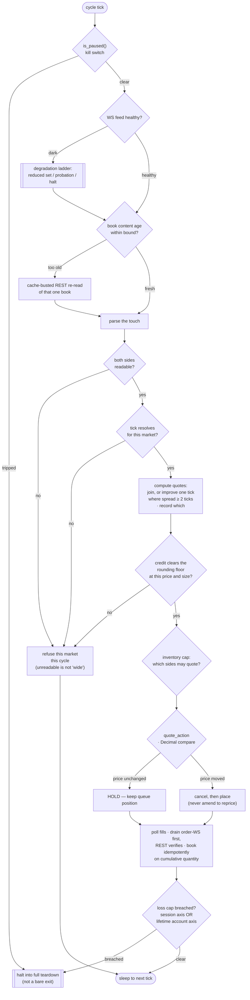
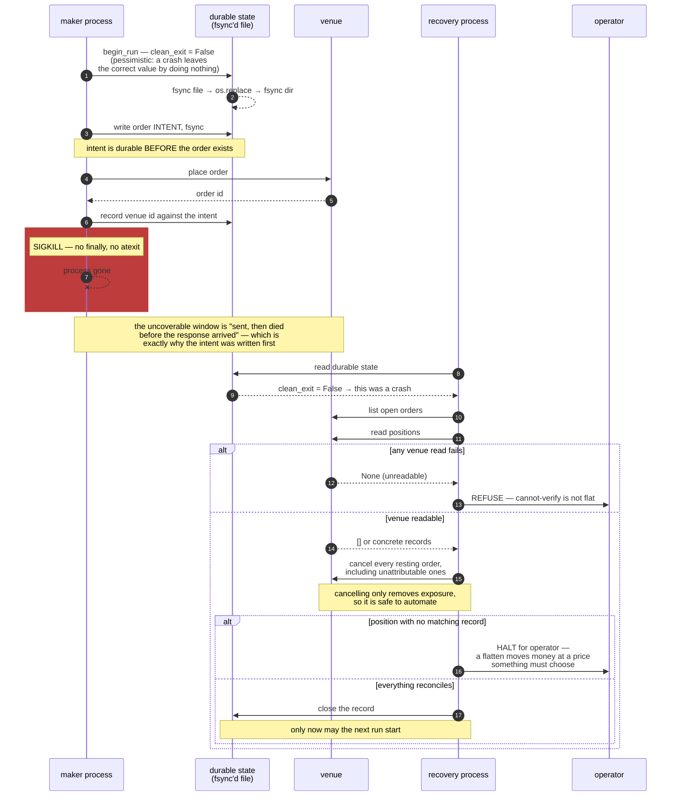

# Architecture

A technical map of the maker engines. For *why* it is built this way — the failure modes it defends
against and the reasoning behind each rail — see [`README.md`](README.md).

## Two programs, one shared core

```
bot/
  poly_us/    the reference maker: quoting loop, inventory, cap, teardown,
              WS book feed, private order feed, side semantics, venue client
  kalshi/     the first-generation maker, plus two files worth reading on their
              own: an exact-Decimal L2 book and a queue-attribution tracker
  core/       money (exact Decimal), durable writes, crash state + recovery,
              safety caps, feed health, venue time, config, logging, redaction
scripts/      the real-money arming shims, an operator cancel tool, a config printer
tests/        pure, mocked, no network
```

**They are separate programs on purpose.** The two venues differ in order semantics (an ask on
Polymarket is expressed as a short buy, priced in the same space as the long side rather than at its
complement), in fee sign (a maker credit on one venue, nothing on the other), in book transport
(snapshots versus L2 deltas), and in queue observability. Unifying them would put a third set of
`if venue ==` branches through the money path, which is the last place in the system that should
carry venue conditionals.

The consequence is honest and visible: the two engines are at different maturity levels. The
Polymarket maker holds `Decimal` end to end and drives its teardown off a single ordered tuple. The
Kalshi maker is `float`-based with a hardcoded tick and a long procedural `main()`. It is retained
because its book maintenance and its queue instrumentation are the strongest parts of the tree, and
because pretending the older engine does not exist would misrepresent how the current one was
arrived at.

## The quote cycle

Per market, every requote interval. The cycle is a sequence of gates, and the *order* of the gates
is the design — several of them are correct only where they are.



Four things in that graph are load-bearing and easy to get wrong:

- **The pause check is the first statement.** Checked after the book read, it has already spent a
  request and already decided a quote.
- **The credit floor is a gate, not a filter applied afterwards.** A book whose price puts the
  per-fill credit below the venue's rounding boundary quotes perfectly, fills perfectly, and earns
  nothing. It is refused up front rather than discovered in the accounting.
- **`quote_action` compares `Decimal`s.** `0.4400` and `0.44` are the same price; a string compare
  there replaces every hold with a cancel-and-replace, forfeiting queue position on every cycle,
  invisibly.
- **The loss-cap check sits after the fill poll**, so a breach halts inside the cycle that
  discovered it rather than one cycle later, with quotes live in between.

## Inventory and the caps

Inventory is capped in **fills, not contracts** (`cap_contracts = size × cap_fills`), because a
contract cap is a wildly different constraint at different sizes — the same number of contracts is a
handful of fills at large size and dozens at small size, so a contract cap silently changes the
experiment when size changes. Caps are per-market, with a global gross-exposure cap on top.

On reaching the cap the maker stops quoting the side that would *add* and keeps quoting the side
that *reduces*. A reducing quote is always sized to the actual inventory, never to the configured
size — a full-size reducer fills through zero and opens a fresh position in the opposite direction,
which is the exact trade the stand-down exists to prevent.

## Safety rails

These hold regardless of configuration.

- **Fail toward doing nothing.** Every uncertain read resolves to the option that costs an
  *opportunity*: an unreadable book refuses the market for the cycle, an unresolvable tick refuses
  the market entirely, a non-finite loss value disables quoting rather than disabling the cap.
- **Three-layer arming.** `DRY_RUN` is the only thing that enables orders; one CLI file can set it,
  from an argv sniff ordered before the config import; a mismatch is a hard stop, never a silent
  downgrade. Shadow mode raises from the placement method, so "placed nothing" is structural.
- **Durable loss cap on two axes.** Session (this run) and lifetime (the sum of per-lane
  loss-to-date across the account, each floored at zero so no lane's profit can buy another lane's
  loss budget). It survives process death; an in-process counter would reset on every crash-restart.
- **Kill switch halts into teardown.** Cancel-all → reconcile-pending → flatten → sweep last, driven
  off one ordered tuple.
- **Cannot-verify is not flat.** `None` (unreadable) and `[]` (confirmed empty) are distinct
  everywhere, in the types and in the tests.
- **Cancelling is automated, flattening is not.** A cancel removes exposure; a flatten moves money
  at a chosen price. Unattributable exposure halts for an operator.
- **The crash record closes only on venue evidence.** Cleared only when the open-orders listing
  succeeded, every order cancelled cleanly, and nothing was unattributable. Otherwise the next start
  refuses.

## Crash and recovery

The design assumption is SIGKILL: no `finally`, no `atexit`, no handler. Everything below follows
from the single fact that the dying process cannot write anything at the moment it dies.



`assess_recovery` is a **pure function** over *(durable state, venue open orders, venue positions)*.
It performs no I/O and makes no venue calls, which is what makes the recovery decision exhaustively
testable — every branch above is a unit test over three inputs, including the branches that are
almost impossible to reproduce against a live venue.

## Feed architecture

Two independent live feeds, each treated as an untrusted subsystem:

- **The book feed (public WS).** Exists to buy request-budget headroom. Health is data-freshness,
  not connection liveness: the freshness clock advances only on a *real* top-of-book change, so the
  watchdog catches the frozen-resend zombie — frames arriving, socket healthy, book never moving —
  as well as plain silence. Failure walks the ladder in the README rather than falling off a cliff,
  and the ladder's states are distinguished by *what evidence clears them*: a reduced-set cycle
  coming back clean is grounds to try the full slate, not grounds to declare recovery.
- **The order feed (private WS).** A fill accelerator only. It has no snapshot, no heartbeat, and no
  sequence number, and the subscription dies silently while the socket still answers pings — so
  liveness is an echo watchdog over the maker's own placements, with an anomaly path for the case
  where the feed has demonstrably delivered since the action (killing a working feed would storm).
  Events are drained *first* and booked through the same cumulative-quantity-idempotent path that
  REST then verifies, so the feed can only make the maker faster, never blinder. Overflow drops the
  *oldest* event, since booking is cumulative and the newest event alone suffices.

Belief in what we hold is never taken from local state alone. When the venue's order store disowns
an order — it purges and lags, and an order can vanish while a fill against it is real — the maker
walks the venue's trade ledger to heal belief, marking recovered fills on the tape so no downstream
read can confuse a recovered fill with a promptly-booked one.

## Testing

Pure, mocked, no network, no credentials; a few tens of seconds. Two disciplines make it load-
bearing rather than decorative:

- **Mutation testing on safety fixes.** Reverting the fix must turn a specific test red. A green
  suite that stays green with the fix removed has pinned nothing — and on one audited batch, six of
  eight nominally-tested fixes were not actually pinned.
- **Venue behaviour pinned against captured real responses**, not hand-written fixtures. A fixture
  written from the same belief as the code can only ever confirm it, and several of the sharpest
  bugs in this project's history were places where the venue's documented behaviour and its actual
  behaviour disagreed.

The conftest sandboxes every operational rail with autouse fixtures — production tapes,
notification delivery, the kill-switch file — each one added after a specific incident where a test
run touched something real.
